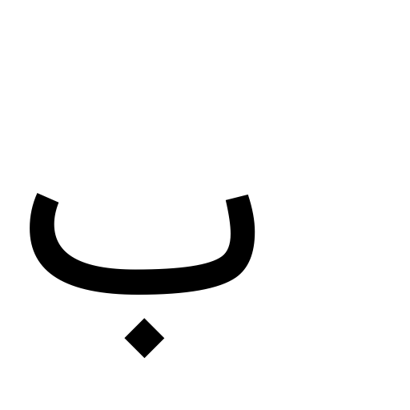

Image data of Persian fonts
PNG images with a size of 512 x 512 pixels are placed for each one Persian letter in the form of a collection of Persian alphabet letters from the list of fonts at the end of the page.

For each letter in an image font as below and its equivalent caption file with such content:
```
 arabic letter lam, B Baran Outline typeface
```

<p align="Sample image">
    
</p>

is placed
In total,``` 6272 images ```with the corresponding caption file are categorized according to the font name in this database. The main ttf file of most of the fonts is in the font and script directory to create images of the Persian ttf font in the root of the project.

To improve the database, you can run the script with other fonts and request money :) Any help from you will make me happy, even giving a simple star.


List of fonts:
```
- B Esfehan Bold
- B Majid Shadow
- B Rose
- B Vosta
- Nahid-WOL
- Sahel-Light
- Vazir-Light
- B Fantasy
- B Mashhad
- B Roya
- B Vosta Italic
- Parastoo
- Sahel-Light-FD
- Vazir-Medium
- B Farnaz
- B Mashhad Bold
- B Roya Bold
- B Yagut
- Parastoo-Bold
- Sahel-Light-FD-WOL
- Vazir-Thin
Arabic Style
Arash
Aria
Arshia
Aseman
Aseman Italic
Badkonak
Badr
Badr Bold
Baran
Baran Italic
Baran Outline
Baran Outline Italic
Bardia
Bardiya Bold
Cheshmeh
Cheshmeh Bold
Chini
Compet
Compset Bold
Davat
Elham
Elm
Elm Bold
Elm Italic
Ferdosi
Haleh
Haleh Bold
Hamid
Helal
Homa
Jadid Bold
Jalal
Jalal Bold
Johar
Kaj
Kamran
Kamran Bold
Kamran Outline
Kareem
Karim Bold
Kaveh
Kidnap
Koodak Bold
Koodak Outline
Kourosh
Lotus
Lotus Bold
Mah
Mahsa
Masjed
Mashhad Bold Italic
Mashhad Italic
Medad
Mehr Bold
Mitra
Mitra Bold
Moj
Morvarid
Narenj
Narm
Nasim Bold
Nazanin
Nazanin Bold
Nazanin Outline
Niki Bold
Niki Border Italic
Niki Outline
Niki Outline Italic
Niki Shadow
Niki Shadow Italic
Nikoo
Nikoo Italic
Patch
Patch Bold
Sahara
Sahra
Sara
Sepideh
Sepideh Outline
Setareh
Setareh Bold
Shadi
Shiraz
Shiraz Italic
Siavash
Sina Bold
Sooreh
Sooreh Bold
Sorkhpust
Tabsom
Tanab
Tawfig Outline
Tehran
Tehran Italic
Tir
Titr Bold
Traffic
Traffic Bold
Vahid Bold
Yagut Bold
Yas
Yas Bold
Yekan
Zaman
Zar
Zar Bold
Ziba
Estedad-Black
Estedad-Bold
Estedad-ExtraBold
Estedad-ExtraLight
Estedad-Light
Estedad-Medium
Estedad-Regular
Estedad-SemiBold
Estedad-Thin
Estedad[wght,kshd]
Gandom
Gandom-FD
Gandom-WOL
Nahid
Nahid-FD
Nahid-FD-WOL
Parastoo-Bold-FD
Parastoo-Bold-FD-WOL
Parastoo-Bold-WOL
Parastoo-FD
Parastoo-FD-WOL
Parastoo-Print
Parastoo-Print-Bold
Parastoo-Print-Bold-FD
Parastoo-Print-Bold-FD-WOL
Parastoo-Print-Bold-WOL
Parastoo-Print-FD
Parastoo-Print-FD-WOL
Parastoo-Print-WOL
Parastoo-WOL
Sahel
Sahel-Black
Sahel-Black-FD
Sahel-Black-FD-WOL
Sahel-Black-WOL
Sahel-Bold
Sahel-Bold-FD
Sahel-Bold-FD-WOL
Sahel-Bold-WOL
Sahel-FD
Sahel-FD-WOL
Sahel-Light-WOL
Sahel-SemiBold
Sahel-SemiBold-FD
Sahel-SemiBold-FD-WOL
Sahel-SemiBold-WOL
Sahel-VF
Sahel-WOL
Samim
Samim-Bold
Samim-Bold-FD
Samim-Bold-FD-WOL
Samim-Bold-WOL
Samim-FD
Samim-FD-WOL
Samim-Medium
Samim-Medium-FD
Samim-Medium-FD-WOL
Samim-Medium-WOL
Samim-WOL
Tanha
Tanha-FD
Tanha-FD-WOL
Tanha-WOL
Vazir
Vazir-Bold
```
